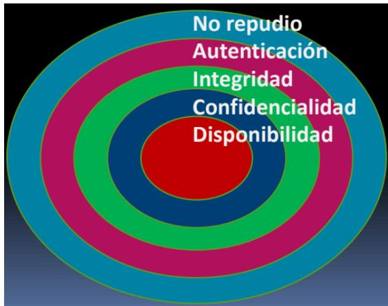
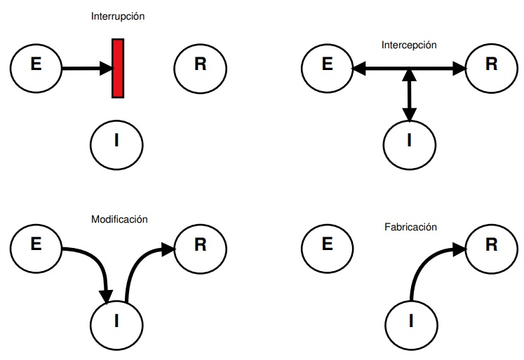

## Unidad 1 - Introducción a la seguridad informática

## Índice

1. [Introducción a la seguridad informática](#1-introducción-a-la-seguridad-informática)
	- [1.1. ¿Qué es la seguridad informática?](#11-qué-es-la-seguridad-informática)
	- [1.2. ¿Por qué es necesaria?](#12-por-qué-es-necesaria)
	- [1.3. ¿Cuándo podemos considerar seguro un sistema?](#13-cuándo-podemos-considerar-seguro-un-sistema)
2. [¿Qué medidas podemos tomar para conseguir un sistema invulnerable (100 % seguro)?](#2-qué-medidas-podemos-tomar-para-conseguir-un-sistema-invulnerable-100-seguro)
	- [2.1. Amenazas](#21-amenazas)
	- [2.2. Ataques](#22-ataques)
		- [2.2.1. Tipos de atacantes](#221-tipos-de-atacantes)
		- [2.2.2. Ataques habituales](#222-ataques-habituales)
		- [2.2.3. Signos de ataques](#223-signos-de-ataques)
		- [2.2.4. Ejemplos de agujeros en la seguridad](#224-ejemplos-de-agujeros-en-la-seguridad)
	- [2.3. Protección](#23-protección)
		- [2.3.1. Medidas de seguridad](#231-medidas-de-seguridad)
		- [2.3.2. Buenas prácticas de seguridad](#232-buenas-prácticas-de-seguridad)
		- [2.3.3. Auditoría de seguridad](#233-auditoría-de-seguridad)
3. [Políticas de seguridad](#3-políticas-de-seguridad)
	- [3.1. ¿Qué aspectos están definidos en una buena política de seguridad?](#31-qué-aspectos-están-definidos-en-una-buena-política-de-seguridad)
	- [3.2. Componentes de una buena política de seguridad](#32-componentes-de-una-buena-política-de-seguridad)

## 1. Introducción a la seguridad informática

## 1.1. ¿Qué es la seguridad informática?

Podemos definirla como el conjunto de medidas y controles que aseguran la confidencialidad, integridad y disponibilidad de los activos de los sistemas informáticos, incluyendo el hardware, el software y toda la información que procesan, almacenan o comunican, pudiendo, además, abarcar otras propiedades, como la autenticación, la autenticidad y el no repudio.

Activo: cualquier elemento valioso de una organización. Pueden ser equipos y componentes hardware, programas y sistemas, o información. Las medidas de seguridad deben establecerse en función del valor de los activos, sus vulnerabilidades y si son críticos para la organización.

## 1.2. ¿Por qué es necesaria?

Antes teníamos la Seguridad de la información, los datos se almacenaban en papel con todos los problemas que luego acarreaba su almacenaje, transporte, acceso y procesado.

Recordemos que: datos + contexto = información

Los sistemas informáticos permiten la digitalización de todo este volumen de informacioón reduciendo el espacio ocupado, pero, sobre todo, facilitando su análisis y procesado. Se gana en ’espacio', acceso, rapidez en el procesado de dicha información y mejoras en la presentación de dicha información.

Pero aparecen otros problemas ligados a esas facilidades. Si es mas fácil transportar la información también hay más posibilidades de que desaparezca 'por el camino'. Si es mas fácil acceder a ella también es más fácil modificar su contenido, etc.

## 1.3. ¿Cuándo podemos considerar seguro un sistema?

Los objetivos principales de la seguridad informática o qué hay que garantizar para considerar a un sistema seguro (o fiable) siguen el acrónimo **CIDAN**:

- **Confidencialidad:** capacidad de garantizar que la información sólo va a estar disponible para las personas o sistemas autorizados. Por ejemplo EFS (Encrypted File System) o cifrado en las comunicaciones.

- **Integridad:** capacidad de garantizar que los datos no fueron modificados sin autorización. Por ejemplo SFC (System File Checker) en Windows, Rootkit hunter en Linux o la firma digital y funciones resumen para comunicaciones.

- **Disponibilidad:** capacidad de garantizar que tanto el sistema como la información van a estar disponibles para los usuarios cuando sea necesario. La alta disponibilidad es la capacidad de que aplicaciones y datos se encuentren operativos para los usuarios autorizados en todo momento y sin interrupciones.

- **Autenticación:** confirmación de la identidad de un usuario, aportando algún modo que permita probar que es quien dice ser.

- **No repudio:** capacidad de garantizar la participación de las partes en una comunicación. Es decir, asegurar que una entidad no pueda negar haber realizado una acción dada.

Estos 5 servicios dependen jerárquicamente unos de otros, por lo que es imprescindible que exista el nivel inferior para que se pueda aplicar el siguiente:

## 2. ¿Qué medidas podemos tomar para conseguir un sistema invulnerable (100 % seguro)?

*Gene Spafford, experto en seguridad informática.*

> "El único sistema seguro es aquel que está apagado y desconectado, enterrado en un refugio de hormigón, rodeado por gas venenoso y custodiado por guardias bien pagados y muy bien armados. Aún así no apostaría mi vida por él."

Para poder defendernos mejor de un enemigo, cuanto más lo conozcamos, mejor.

## 2.1. Amenazas, vulnerabilidades y riesgos

Una **amenaza** es toda acción que aprovecha una **vulnerabilidad** para atentar contra la seguridad de un sistema informático pudiendo tener un potencial efecto negativo sobre el mismo, es decir, las amenazas son las posibles vías de entrada que puede tener un sistema.

Cuando se materializa una amenaza decimos que se produce un **ataque**.

Entendemos por **vulnerabilidad** aquella debilidad o fallo en un sistema que pone en riesgo la seguridad del mismo pudiendo permitir que un ataque comprometa la integridad, disponibilidad o confidencialidad de todo o parte del sistema. Estos “agujeros" pueden tener distintos orígenes como: fallos de diseño, errores de configuración o carencias en los procedimientos.

Un **riesgo** es la probabilidad de que se materialice una amenaza en un ataque causando daños o pérdidas (impacto). Los factores de los que depende un riesgo son:

- Vulnerabilidades del sistema.
- Amenazas que puedan aprovechar las vulnerabilidades. Ej. virus, ataques de denegación de servicios, incendios, etc.
- Impacto (consecuencias del daño causado) del ataque en el sistema. Puede ser cuantitativo (como un coste económico) o cualitativo (como dañar la imagen de la organización o acarrear consecuencias legales).

Podemos dividir las amenazas de la siguiente manera:

- **Amenazas provocadas por personas:**
	- **Pasivas:** intentan entrar en un sistema sólo por el hecho de conseguirlo y no les interesa modificarlo o destruirlo.
	- **Activas:** intentan entrar en un sistema para aprovecharse de él o destruirlo.
- **Amenazas físicas y lógicas:**
	- **Amenazas físicas y ambientales:** afectan a las instalaciones y/o al hardware contenido en ellas y es el primer nivel de seguridad que se debe proteger.
	- **Amenazas lógicas:** son software o código que pueden afectar o dañar un sistema.

## 2.2. Ataques

Podemos distinguir los siguientes tipos de ataques en función del objetivo de seguridad que comprometen (confidencialidad, integridad, disponibilidad, autenticidad):

- **Interrupción:** este tipo de ataque provoca que el sistema o información sea inaccesible para usuarios que deberían poder acceder. No se garantiza: disponibilidad.

- **Intercepción:** este tipo de ataque consiste en acceder a información del sistema sin autorización. No se garantiza: confidencialidad.

- **Modificación:** consiste en que la información del sistema se ve alterada, de forma que se añade, modifica o eliminan datos de la información original. No se garantiza: integridad, confidencialidad.

- **Fabricación:** consiste en generar información falsa, engañando a los usuarios para hacerles creer que esa es la información del sistema. No se garantiza: autenticidad.

A continuación se muestran gráficamente los distintos tipos de ataques empleando un emisor (E), un receptor (R) y un intruso (I):

## 2.2.1. Tipos de atacantes

- **Hackers:** personas expertas en aspectos técnicos relacionados con la informática que se dedican a investigar los sistemas de seguridad para descubrir sus vulnerabilidades e informar a los propietarios. No buscan dañar el sistema ni beneficio económico.

- **Crackers:** también conocidos como hackers de sombrero negro, intentan acceder a los sistemas y recursos de la red con fines maliciosos.

- **Programadores de malware:** programadores expertos que crean programas maliciosos y los ponen en la red con el fin de que se distribuyan rápidamente ocasionando el máximo daño posible.

- **Phreakers:** personas expertas en telecomunicaciones que manipulan la red telefónica para realizar llamadas gratuitas.

- **Spammers:** personas que envían millones de correos electrónicos no deseados (spam), colapsando los servidores de correo y los buzones de los destinatarios. Normalmente utilizan virus para realizar el envío de spam a todos los destinatarios de la agenda de direcciones.

- **Estafadores:** utilizan servicios de mensajería y correo electrónico para engañar a personas para que den información confidencial.

- **Ciberterroristas:** expertos informáticos al servicio de países y organizaciones con el fin de espiar y sabotear sistemas.

- **Sniffers:** escuchan el tráfico de red con el objetivo de descifrarlo.

- **Lammers o script-kiddies:** personas (habitualmente jóvenes) que sin grandes conocimientos de informática se creen hackers. Descargan programas de Internet para realizar ataques sin saber muy bien cómo funcionan, lo que hace que sean fácilmente detectados.

- **Newbie:** hacker novato.

- **Pirata informático, ciberdelincuente o delincuente informático:** persona dedicada a realizar actos delictivos, p.e. fraudes bancarios, estafas, copias ilegales de software, música, películas, etc.

- **Personal interno:** son trabajadores de una organización que de forma voluntaria o involuntaria amenazan la seguridad del sistema.

## 2.2.2. Ataques habituales

- **Sniffing:** espiar datos que viajan por la red.

- **Spoofing:** suplantación de identidad dentro de un sistema de comunicación.

- **Conexión no autorizada:** establecimiento de conexiones no autorizadas o con privilegios elevados.

- **Malware:** software malicioso que tiene como objetivo perjudicar el sistema informático. Dentro del malware podemos encontrar virus, ransomware, spyware, adware, gusanos, troyanos, etc.

- **Keyloggers:** mecanismos de hardware o software que registran las pulsaciones de teclado.

- **Denegación de Servicio (DoS):** saturar de peticiones un determinado servicio evitando que los usuarios auténticos puedan utilizarlo. El DDoS es la versión distribuida de este ataque.

- **Phishing e ingeniería social:** esta técnica aprovecha al usuario como vulnerabilidad. Consiste en engañar a los usuarios para que sean ellos mismos los que proporcionen cierta información confidencial. Utilizan correos electrónicos, redes sociales, copias falsas de páginas web...

- **Pharming:** se trata de redirigir un nombre de dominio a otra máquina distinta falsificada y fraudulenta.

- **Inyección de código SQL:** consiste en inyectar nuevas sentencias SQL que el servidor no debería aceptar.

- **Cracking de passwords:** consiste en descubrir contraseñas utilizando ataques por diccionario o fuerza bruta.

## 2.2.3. Signos de ataques

- El sistema se para sin motivo aparente.
- Los logs del sistema reflejan intentos de escritura fallidos en archivos.
- Las prestaciones del sistema son inexplicablemente bajas.
- Incremento repentino del tráfico de red.
- Logins en el sistema desde lugares y horas extrañas.
- Aparición de archivos con nombres sospechosos.
- Apertura inusual de puertos.
- Los usuarios del sistema, incluyendo al administrador, no pueden acceder al mismo.

## 2.2.4. Ejemplos de agujeros en la seguridad

- Contraseñas débiles, fáciles de adivinar o por defecto.
- Cuentas de usuario inactivas, no utilizadas o con privilegios excesivos.
- Uso de servicios no seguros (tftp, ftp, sendmail).
- Uso de consolas inseguras (telnet, rlogin).
- Versiones no actualizadas de sistema operativo y aplicaciones.
- Políticas de copias de seguridad inexistentes o mal configuradas.

## 2.3. Protección

## 2.3.1. Medidas de seguridad

Las medidas de seguridad se pueden clasificar de la siguiente manera:

- **Según el recurso a proteger:**
	- **Seguridad física:** conjunto de medidas que protegen el hardware de incendios, robos, interferencias electromagnéticas o desastres naturales. Dentro de este tipo de medidas destacan:
		- Control de acceso mediante tarjetas magnéticas, tarjetas electrónicas y sistemas biométricos.
		- Sistemas de detección y extinción de incendios que no dañen los equipos.
		- Sistemas de Alimentación Ininterrumpida (SAI).
	- **Seguridad lógica:** conjunto de medidas que protegen el software de robos y pérdidas de información, modificación de la información, malware, accesos no autorizados, ataques desde la red, etc. Medidas destacables de seguridad lógica son:
		- Cifrado que garantice la confidencialidad.
		- Firmas digitales para garantizar el no repudio y la autenticación.
		- Firewalls para el control de tráfico permitido en la red.
		- Listas de control de acceso y políticas de contraseñas.
		- Antimalware.

Según el momento en el que se ponen en marcha las medidas de seguridad:

- **Seguridad activa (antes):** conjunto de medidas que pretenden prevenir los daños en el sistema reduciendo amenazas. Algunas medidas de seguridad activa son:
	- Uso de contraseñas.
	- Cifrado de discos y ficheros sensibles.
	- Uso de listas de control de acceso (ACL).
	- Uso de firewalls.
	- Otorgar a cada usuario los privilegios mínimos y necesarios.
	- Formar a los usuarios para hacer un uso seguro del sistema.
- **Seguridad pasiva (después):** conjunto de medidas que buscan minimizar el impacto ocasionado por un ataque cuando éste ha conseguido dañar el sistema. Podemos destacar medidas de seguridad pasiva como:
	- Distribuir el almacenamiento de datos empleando RAID.
	- Establecer políticas de copias de seguridad e imágenes de respaldo.
	- Utilizar sistemas de alimentación ininterrumpida (SAI).

## 2.3.2. Buenas prácticas de seguridad

- Mantener actualizado el SO y las aplicaciones del sistema.
- Utilizar siempre un antivirus, mantenerlo actualizado (surgen más de 20 virus cada día) y realizar revisiones periódicas.
- Utilizar antispyware/antiadware: la mayoría de antivirus no detectan ni eliminan los programas espía.
- Eliminar la cuenta de invitado y cambiar los nombres de cuentas de administrador por defecto.
- Utilizar contraseñas seguras diferentes para cada uno de los servicios.
- No visitar sitios web potencialmente peligrosos. La mayoría de los secuestros de navegador se producen al visitar páginas que ofrecen descargas pirata o pornografía. Si queremos descargar freeware u otro tipo de software es mejor hacerlo desde la página oficial del fabricante.
- Evitar programas de intercambio de archivos P2P.
- Evitar utilizar aplicaciones que están en el punto de mira de los atacantes (Internet Explorer, Outlook Express).
- Instalar, mantener activo y bien configurado un firewall.
- Nunca abrir archivos adjuntos a correos electrónicos de los que no estamos seguros. Si creemos que no deberíamos recibir un fichero (aunque conozcamos al remitente), o éste tiene un tamaño, nombre o extensión sospechosos, no debemos abrirlo.
- Eliminar todo el spam.
- No participar en cadenas de mensajes.

## 2.3.3. Auditoría de seguridad

Es un análisis de amenazas y riesgos potenciales para posteriormente adoptar medidas de seguridad. Sus objetivos son:

- Revisar la seguridad de los entornos y sistemas.
- Verificar el cumplimiento de la normativa y legislación vigentes.
- Elaborar un informe independiente.

A continuación se enumeran una serie de ejemplos de auditorías:

- Auditoría wireless.
- Auditoría de acceso a sistemas operativos.
- Auditoría de acceso a datos y aplicaciones seguras.
- Auditoría de versiones inseguras de aplicaciones y sistema operativo.

Dentro de la normativa empleada en seguridad tenemos:

- **COBIT:** Objetivos de Control de las Tecnologías de la Información y relacionadas.
- **ISO 27002:** Código Internacional de buenas prácticas de seguridad de la información.
- **ISO 27001:** Sistemas de Gestión de Seguridad de la Información (SGSI). Requisitos.

## 3. Políticas de seguridad

La Política de Seguridad es el documento de referencia que define los objetivos de seguridad de una organización y las medidas que deben implementarse para alcanzar dichos objetivos. Consta de 2 partes:

- **Política general:**
	- Análisis de vulnerabilidades.
	- Identificación de amenazas.
	- Definición de objetivos de seguridad.

- **Reglas específicas:** definen las características y acciones concretas para cada servicio o sistema, orientadas a cumplir los objetivos de la política general.

## 3.1. ¿Qué aspectos están definidos en una buena política de seguridad?

- **Autoridad:** ¿Quién es el responsable?
- **Ámbito:** ¿A quién afecta?
- **Caducidad:** ¿Cuándo pierde validez?
- **Especificidad:** ¿Qué se requiere?
- **Claridad:** ¿Es entendible por todos?

## 3.2. Componentes de una buena política de seguridad

- Guía de compra de HW y SW, especificando las funciones relacionadas con la seguridad deseadas.
- Política de privacidad que defina el nivel mínimo de privacidad para acceder a archivos, bases de datos, correos electrónicos, etc.
- Política de acceso que defina los permisos y privilegios de los usuarios, conexiones permitidas a redes internas y externas, etc.
- Política de responsabilidad donde se definan las responsabilidades de los usuarios y administradores. Detallan a quién avisar, cuándo y cómo hacerlo.
- Política de autenticación que establezca factores de autenticación, dispositivos de autenticación o características de las contraseñas.
- Política de mantenimiento que determina cómo se hace el mantenimiento interno y externo, si se permite el mantenimiento remoto, contratar mantenimiento externo, etc.
- Política de comunicación de violaciones que defina qué tipo de amenazas se deben comunicar, a quién y cómo.
- Declaración de disponibilidad que aclare las expectativas de los usuarios en cuanto a disponibilidad de recursos. Se centra en el impacto de la pérdida de recursos y define temas como redundancia, tiempos de recuperación, etc.
- Toda la información de apoyo necesaria para que los usuarios, técnicos y la administración sepan cómo actuar ante cualquier eventualidad.