# Sistema de Alimentación Ininterrumpida (SAI)

> Se han incorporado las imágenes y capturas extraídas del PDF en `UD2/images`.

## Índice

1. [Introducción](#1-introducción)
    - [Regulador automático de voltaje (AVR)](#regulador-automático-de-voltaje-avr)
2. [Corriente alterna y corriente continua](#2-corriente-alterna-y-corriente-continua)
3. [Tipos de SAI según su tecnología](#3-tipos-de-sai-según-su-tecnología)
    - [SAI Off-Line](#31-sai-off-line)
    - [SAI Interactivo (In-Line)](#32-sai-interactivo-in-line)
    - [SAI On-Line](#33-sai-on-line)
4. [¿Qué tipo de SAI elegir?](#4-qué-tipo-de-sai-elegir)
5. [Potencia de un SAI](#5-potencia-de-un-sai)
    - [Potencia activa, potencia aparente y factor de potencia](#51-potencia-activa-potencia-aparente-y-factor-de-potencia)
    - [Ejemplos de cálculo de potencia](#ejemplos-de-cálculo-de-potencia)
6. [Cálculo de la autonomía en modo batería](#6-cálculo-de-la-autonomía-en-modo-batería)
    - [Ejemplo con dos baterías](#ejemplo-con-dos-baterías)
7. [Tamaños y formatos](#7-tamaños-y-formatos)
8. [Software de control](#8-software-de-control)

## 1. Introducción

La seguridad es uno de los aspectos más importantes de nuestros sistemas. Además de la seguridad lógica (firewalls, copias de seguridad y contraseñas, entre otras medidas), también hay que tener en cuenta la seguridad física: proteger el hardware de elementos externos como incendios, inundaciones, picos de tensión y cortes del suministro eléctrico.

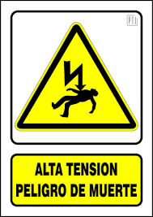

Un SAI o UPS (*Uninterruptible Power Supply*) es un dispositivo que, gracias a sus baterías, puede proporcionar energía eléctrica tras un apagón a los equipos conectados. También puede mejorar la calidad de la energía que reciben, filtrando subidas y bajadas de tensión y eliminando armónicos de la red.

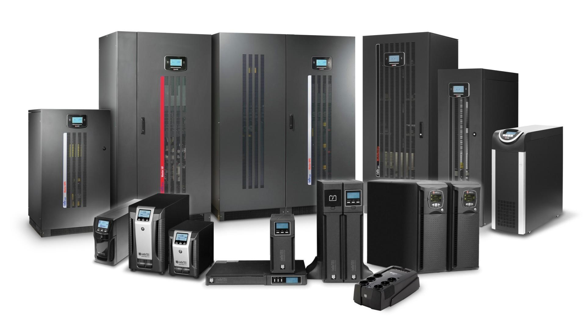

Cuando se interrumpe el suministro eléctrico, el SAI empieza a alimentar los equipos desde sus baterías. Al restablecerse la corriente, vuelve a filtrar la electricidad de la red y recarga las baterías. Los equipos siguen recibiendo corriente alterna (AC), pero la autonomía de las baterías es limitada. Si el corte se prolonga, hay que apagar los equipos; algunos SAI pueden hacerlo automáticamente mediante software.

Según su tamaño, un SAI puede albergar una o varias baterías. Las de los equipos domésticos son parecidas a las utilizadas en motocicletas.

### Regulador automático de voltaje (AVR)

Un AVR (*Automatic Voltage Regulator*) puede estar integrado en un SAI o ser un dispositivo independiente. Acepta un rango variable de tensión de entrada y entrega una tensión estable, reduciendo las subidas y bajadas de la red.

No debe confundirse un SAI con una regleta protectora: algunas regletas filtran la electricidad o protegen contra sobretensiones, pero no tienen baterías y no mantienen los equipos encendidos si falla el suministro.

Los SAI, que originalmente eran equipos caros, se han popularizado y hoy existen modelos básicos asequibles. Son una inversión en seguridad y disponibilidad.

## 2. Corriente alterna y corriente continua

- **Corriente alterna (AC, *Alternating Current*):** la producen los alternadores de las centrales eléctricas. Es la corriente que se utiliza en las viviendas y cambia de sentido 50 veces por segundo (frecuencia de 50 Hz).
- **Corriente continua (DC, *Direct Current*):** la producen las baterías, las pilas y las dinamos. No cambia de sentido; por ello tiene un polo positivo y otro negativo.

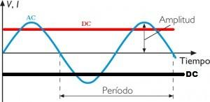

## 3. Tipos de SAI según su tecnología

Hay tres tipos principales: **Off-Line**, **Interactivo (In-Line)** y **On-Line**.

### 3.1. SAI Off-Line

Son los más simples. La corriente no se filtra mediante AVR y pasa directamente a los dispositivos conectados. Cuando detecta un fallo, el SAI empieza a suministrar electricidad desde la batería. La conmutación tarda unos milisegundos y, según la calidad del equipo, podría no ser suficientemente rápida para dispositivos delicados.

Tiene dos modos de funcionamiento:

- **Modo AC:** mientras no falle el suministro, la salida es la entrada AC sin filtrar.
- **Modo batería:** cuando falla el suministro, la batería alimenta los equipos. Al no ser un sistema activo, hay un pequeño tiempo de conmutación, normalmente de 2 a 10 ms.

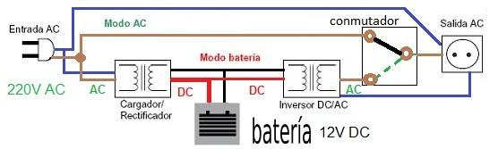

### 3.2. SAI Interactivo (In-Line)

Incluye un AVR que filtra continuamente el suministro y protege frente a sobretensiones y bajadas de tensión. Así, la fuente de alimentación de los equipos recibe una tensión más estable.

Tiene dos modos de funcionamiento:

- **Modo AC:** la salida procede de la entrada AC y está filtrada por el AVR.
- **Modo batería:** si se interrumpe la corriente, la batería suministra la electricidad tras un pequeño tiempo de conmutación.

Las baterías solo entran en funcionamiento cuando se detecta un corte. Son apropiados para equipos domésticos (televisores, ordenadores y consolas) y oficinas pequeñas.

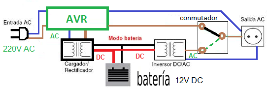

### 3.3. SAI On-Line

Realiza una doble conversión: transforma la corriente alterna de entrada en continua y después vuelve a convertirla en alterna. Proporciona un suministro estable sin tiempo de conmutación, por lo que se utiliza para servidores y equipos industriales importantes.

Tiene tres modos de funcionamiento:

1. **Modo bypass:** desvía la corriente de entrada directamente a la salida, sin doble conversión. Puede activarse durante el mantenimiento, ante sobrecargas o por incidencias internas. En este modo no se proporciona la protección habitual frente a problemas de la red.
2. **Modo On-Line o de doble conversión:** convierte la corriente AC de entrada en DC y después en AC limpia y estable. La carga recibe energía sin interrupción y con un tiempo de conmutación de 0 ms.
3. **Modo batería:** si falla la red eléctrica, las baterías alimentan inmediatamente el inversor para mantener los equipos encendidos.

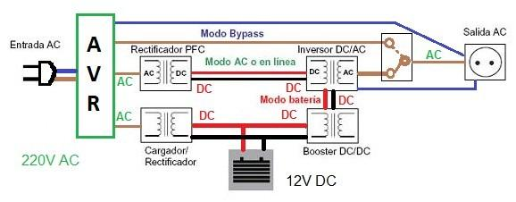

## 4. ¿Qué tipo de SAI elegir?

- **Off-Line:** para zonas con pocas perturbaciones y una red eléctrica estable; adecuado para instalaciones pequeñas.
- **Interactivo:** para ordenadores de gama media o baja, consolas, pequeños servidores y equipos de oficina. Es la opción recomendada para la mayoría de los dispositivos.
- **On-Line:** para servidores, clústeres e instalaciones críticas, como redes de datos, telecomunicaciones e industria.

## 5. Potencia de un SAI

Para elegir un SAI hay que sumar las potencias de los equipos que se conectarán durante el funcionamiento con baterías. La carga determina tanto la autonomía como la capacidad de respuesta. Una carga excesiva puede provocar que el SAI se apague sin llegar a alimentar los equipos.

Las unidades de potencia que se utilizan para clasificar un SAI son:

- **Voltiamperio (VA):** potencia aparente ($S$). No debe superarse.
- **Vatio (W):** potencia activa, efectiva o real ($P$), que pueden consumir los equipos. Tampoco debe superarse.

### 5.1. Potencia activa, potencia aparente y factor de potencia

En corriente alterna, la **potencia activa** es la que produce trabajo efectivo (luz, calor, movimiento o procesamiento) y se mide en vatios. La **potencia aparente** tiene en cuenta la tensión y la corriente que circula, aunque parte de esa corriente no produzca potencia activa; se mide en voltiamperios y siempre es igual o mayor que la potencia activa.

El **factor de potencia (FP)** expresa la relación entre la potencia activa y la potencia aparente. Se expresa como un número o porcentaje, es menor o igual a 1 y su valor ideal es 1. En un PC moderno suele acercarse a 1; en equipos antiguos era habitual encontrar valores del 60 % o 70 %.

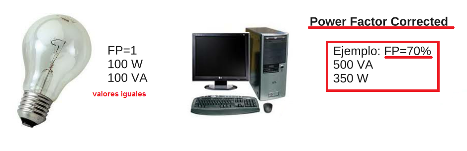

Las fórmulas son:

- Potencia aparente:

  $$S = V \times I \quad (VA)$$

  Si se conoce la potencia activa:

  $$S = \frac{P}{FP}$$

- Potencia activa:

  $$P = V \times I \times FP \quad (W)$$

  También:

  $$W = VA \times FP$$

En algunos aparatos, como radiadores, planchas o bombillas incandescentes, los valores en W y VA coinciden (FP = 1). En equipos electrónicos pueden diferir; VA siempre es igual o superior a W:

$$S \geq P \quad (VA \geq W)$$

Los SAI suelen indicar el factor de potencia o las potencias en W y VA. Cuanto mayor sea el FP, más potencia real puede ofrecer el SAI para una potencia aparente determinada. Por ejemplo, un SAI de 1000 VA puede ofrecer 600 W con FP 0,6 o hasta 900 W con FP 0,9. En modelos básicos es habitual un FP de 0,6; en modelos profesionales, de 0,8 a 0,9.

Para dimensionar un SAI hay que comprobar que ni la potencia activa ni la aparente de los equipos conectados superen los valores máximos del SAI. Para ello hay que conocer el consumo de los dispositivos y, cuando sea necesario, su factor de potencia.

#### Ejemplos de cálculo de potencia

- Con una tensión de 230 V y una corriente de 3 A:

  $$3\ A \times 230\ V = 690\ VA$$

- Con un FP de 0,7, la potencia activa correspondiente es:

  $$690\ VA \times 0{,}7 = 483\ W$$

- Si se conocen 483 W y un FP de 0,7, la potencia aparente es:

  $$483\ W / 0{,}7 = 690\ VA$$

Al adquirir un SAI, hay que consultar la documentación y comprobar sus valores máximos de salida, tanto en VA como en W.

Un ejemplo de SAI doméstico APC ofrece 210 W o 350 VA. Su factor de potencia es:

$$210 / 350 = 0{,}6$$

Por tanto, 350 VA multiplicados por 0,60 dan 210 W.

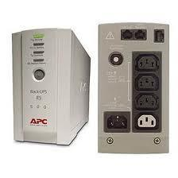
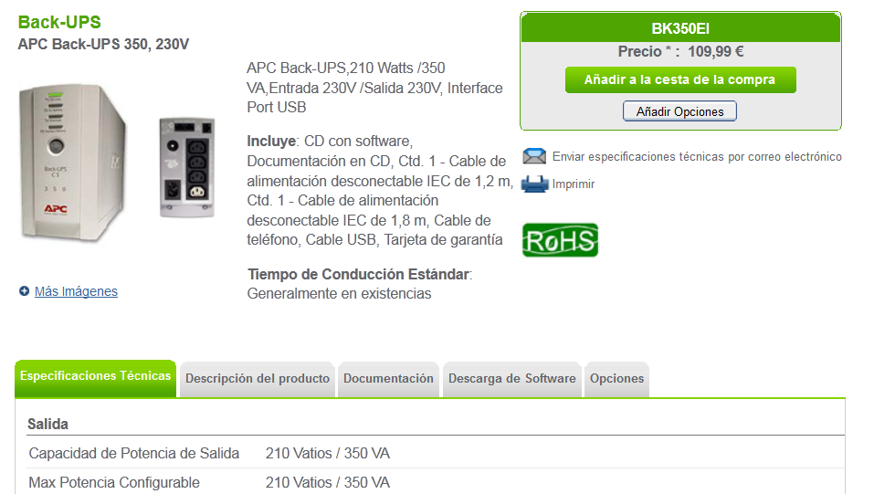
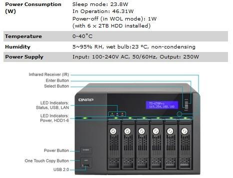

Para un servidor NAS QNAP con un consumo máximo de 46,31 W, la potencia activa está dentro del límite de 210 W. Suponiendo un FP conservador de 0,6 para estimar la potencia aparente:

$$46{,}31\ W / 0{,}6 = 77{,}18\ VA$$

Los 77,18 VA del NAS están por debajo de los 350 VA del SAI, por lo que ese modelo sería suficiente para el NAS.

En cambio, una estación de trabajo HP Z420 con una alimentación de 600 W requeriría, usando el mismo FP de 0,6:

$$600\ W / 0{,}6 = 1000\ VA$$

El SAI de 210 W / 350 VA no sería adecuado. Ante un corte, se sobrecargaría y dejaría de actuar.

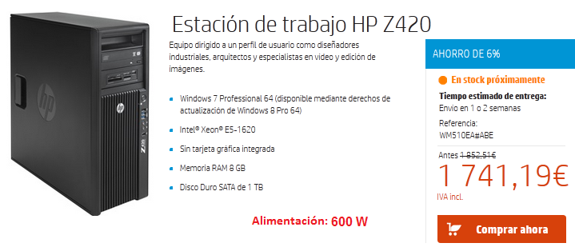

Del mismo modo, un SAI de 1000 VA con FP 0,6 puede proporcionar 600 W. No debería conectarse a él un conjunto de equipos que demande 900 W, porque se superaría su potencia activa y podría dejar de suministrar energía para protegerse.

## 6. Cálculo de la autonomía en modo batería

Si se conocen las especificaciones de las baterías, puede estimarse cuánto durarán cuando falle el suministro. La autonomía aproximada es la energía almacenada multiplicada por la eficiencia del SAI y dividida por la potencia activa consumida:

$$t\ (h) = \frac{Capacidad\ de\ la\ batería\ (Wh) \times Eficiencia}{Potencia\ activa\ de\ la\ carga\ (W)}$$

Si se conocen el número y las características de las baterías:

$$t\ (h) = \frac{N \times V \times Ah \times Eff}{P_{carga}}$$

Donde:

- $N$: número de baterías del SAI.
- $V$: tensión de las baterías.
- $Ah$: capacidad de las baterías en amperios-hora.
- $Eff$: eficiencia del SAI. Suele oscilar entre el 90 % y el 98 %; para cálculos generales puede usarse 0,95.
- $P_{carga}$: potencia activa real de los equipos, en W. Si solo se conoce la potencia aparente en VA, se multiplica por el factor de potencia.

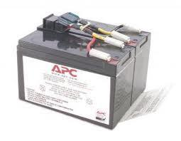
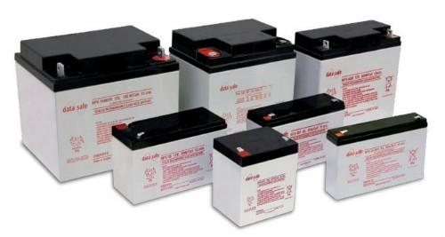

El resultado se obtiene en horas. Para expresarlo en minutos, se multiplica por 60. La potencia activa se usa porque la capacidad de la batería se expresa en Wh. La potencia aparente sirve para dimensionar el SAI, pero no se utiliza directamente para calcular la autonomía.

#### Ejemplo con dos baterías

Para un SAI con dos baterías de 12 V y 9 Ah, una eficiencia del 95 % y una carga máxima de 700 W:

$$t = \frac{2 \times 12 \times 9 \times 0{,}95}{700} = 0{,}29314\ h \approx 17\ minutos$$

Aunque el SAI admita equipos de hasta 700 W, conectar una carga menor aumenta la autonomía. Para una carga de 350 W:

$$t = \frac{2 \times 12 \times 9 \times 0{,}95}{350} = 0{,}586\ h \approx 35\ minutos$$

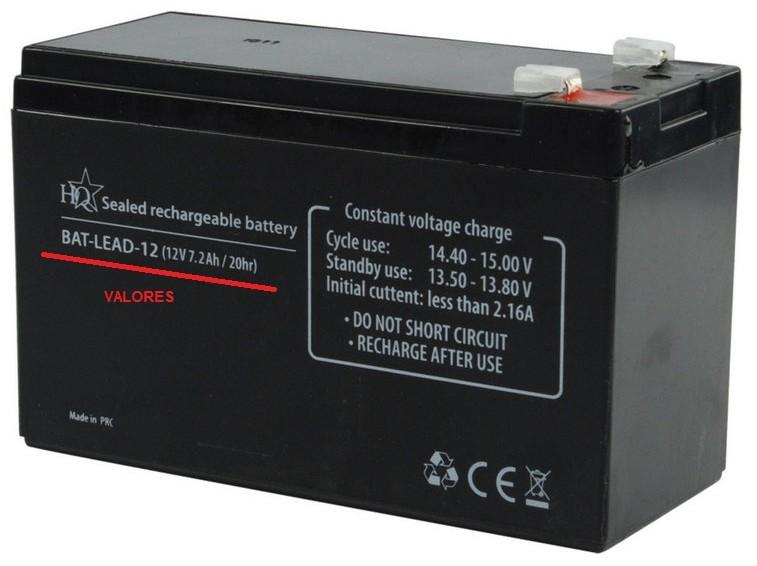

## 7. Tamaños y formatos

Los SAI existen en distintos tamaños y formatos: torre, regleta y rack para armarios, entre otros. La capacidad necesaria depende de los equipos que haya que alimentar, desde un PC hasta un centro de proceso de datos (CPD).

El PDF muestra, entre otros ejemplos, un SAI modular de 1 MW ampliable en bloques de 200 kW, un SAI APC para CPD con una potencia de salida de 800 kW / 800 kVA y un equipo de potencia intermedia de 10 000 VA / 8000 W.

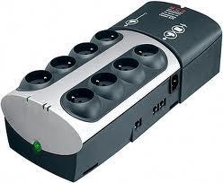
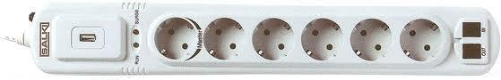
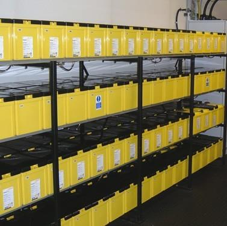
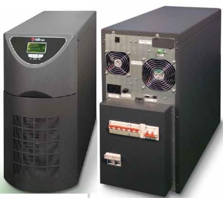
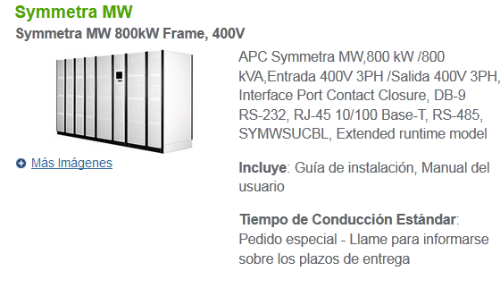
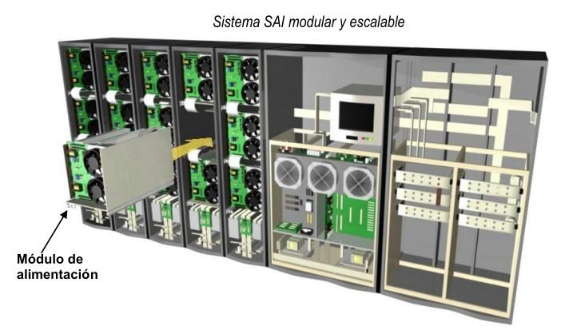

APC ofrece una herramienta para elegir un SAI: [UPS Selector](http://www.apc.com/tools/ups_selector/index.cfm).

## 8. Software de control

Muchos SAI incluyen software que se instala en el ordenador conectado. Si falla la corriente, el programa controla la autonomía restante y apaga el ordenador antes de que se agoten las baterías, para evitar daños.

La comunicación entre el SAI y el ordenador suele realizarse mediante USB o puerto serie RS-232. Esta conexión se denomina **lazo cerrado**. En un sistema de **lazo abierto**, el ordenador se apagaría al agotarse las baterías, con la consecuente pérdida de datos. Los SAI también suelen incorporar una alarma sonora que avisa cuando están funcionando con baterías.

Algunos incluyen un software tipo *watchdog* o «perro guardián», que puede reiniciar automáticamente el PC si el sistema operativo permanece bloqueado durante un tiempo determinado. También puede enviar al administrador avisos por correo electrónico sobre las incidencias.

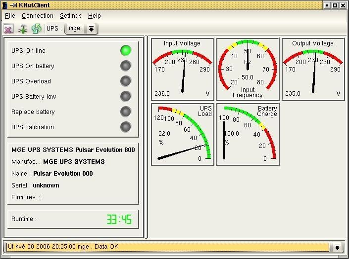
