## Unidad 2 - Seguridad física

## Índice

1. [Introducción a la seguridad física](#1-introducción-a-la-seguridad-física)
2. [Los CPD](#2-los-cpd)
	- [2.1. Factores a contemplar para la localización de un CPD](#21-factores-a-contemplar-para-la-localización-de-un-cpd)
	- [2.2. Ejemplos de CPD](#22-ejemplos-de-cpd)
3. [Amenazas de los equipos](#3-amenazas-de-los-equipos)
	- [3.1. Desastres naturales](#31-desastres-naturales)
	- [3.2. Desastres del entorno](#32-desastres-del-entorno)
4. [Sistemas de protección física](#4-sistemas-de-protección-física)
	- [4.1. Controles de presencia y acceso](#41-controles-de-presencia-y-acceso)
		- [4.1.1. Tarjetas de identificación y llaves](#411-tarjetas-de-identificación-y-llaves)
		- [4.1.2. Código de seguridad](#412-código-de-seguridad)
		- [4.1.3. Sistemas biométricos](#413-sistemas-biométricos)
	- [4.2. Sistemas de climatización](#42-sistemas-de-climatización)
		- [4.2.1. Pasillo frío - pasillo caliente](#421-pasillo-frío---pasillo-caliente)
		- [4.2.2. Freecooling](#422-freecooling)
		- [4.2.3. Puertas de reducción de carga térmica](#423-puertas-de-reducción-de-carga-térmica)
	- [4.3. Sistemas contra incendios](#43-sistemas-contra-incendios)
	- [4.4. Centros de respaldo](#44-centros-de-respaldo)
5. [Plan de contingencia física](#5-plan-de-contingencia-física)
6. [Almacenamiento de información](#6-almacenamiento-de-información)
	- [6.1. Políticas de almacenamiento](#61-políticas-de-almacenamiento)
		- [6.1.1. Política de almacenamiento en equipos de trabajo](#611-política-de-almacenamiento-en-equipos-de-trabajo)
		- [6.1.2. Política de almacenamiento en la red corporativa](#612-política-de-almacenamiento-en-la-red-corporativa)
		- [6.1.3. Política sobre el uso de dispositivos externos](#613-política-sobre-el-uso-de-dispositivos-externos)
		- [6.1.4. Política de almacenamiento en la nube](#614-política-de-almacenamiento-en-la-nube)
		- [6.1.5. Política de copias de seguridad](#615-política-de-copias-de-seguridad)
	- [6.2. Almacenamiento redundante y distribuido](#62-almacenamiento-redundante-y-distribuido)
	- [6.3. Almacenamiento remoto y extraíble](#63-almacenamiento-remoto-y-extraíble)
		- [6.3.1. Network Attached Storage](#631-network-attached-storage)
		- [6.3.2. Storage Area Network](#632-storage-area-network)
		- [6.3.3. Cloud storage](#633-cloud-storage)
7. [Hardware de protección física](#7-hardware-de-protección-física)
	- [7.1. Componentes](#71-componentes)
	- [7.2. Características](#72-características)
		- [7.2.1. Potencia](#721-potencia)
		- [7.2.2. Autonomía](#722-autonomía)
		- [7.2.3. Tiempo de recarga](#723-tiempo-de-recarga)
		- [7.2.4. Tipos de conectores](#724-tipos-de-conectores)
		- [7.2.5. Arranque en frío](#725-arranque-en-frío)
	- [7.3. Tipos de SAI](#73-tipos-de-sai)
		- [7.3.1. SAI Offline](#731-sai-offline)
		- [7.3.2. SAI Interactivo (Inline)](#732-sai-interactivo-inline)
		- [7.3.3. SAI Online](#733-sai-online)
	- [7.4. Arquitectura entre SAI](#74-arquitectura-entre-sai)
		- [7.4.1. Distribuida](#741-distribuida)
		- [7.4.2. Centralizada](#742-centralizada)
		- [7.4.3. Modular](#743-modular)
		- [7.4.4. Modular granulada](#744-modular-granulada)

## 1. Introducción a la seguridad física

Como vimos en la unidad 1, la **seguridad física** es el conjunto de medidas que protegen el hardware de incendios, robos, interferencias electromagnéticas o desastres naturales, destacando las siguientes medidas:

- Control de acceso mediante tarjetas magnéticas, tarjetas electrónicas, sistemas biométricos, etc.
- Sistemas de detección y extinción de incendios que no dañen los equipos.
- Sistemas de Alimentación Ininterrumpida (SAI).

El hardware suele ser el elemento más caro del sistema informático y es frecuente olvidarse de su protección. Las medidas deben establecerse en base al riesgo de que se produzcan determinadas amenazas.

## 2. Los CPD

Un **Centro de Procesamiento de Datos** o **CPD** es la instalación que centraliza las operaciones y la infraestructura de TI de una organización y en la que se almacenan, procesan, tratan y difunden datos y aplicaciones. La mayoría de medianas y grandes empresas cuentan, al menos, con un CPD.

Las características de un CPD son las siguientes:

- Su hardware es muy caro.
- Deben estar operativos 24/7/365, por lo que deben ser tolerantes a fallos.
- Consumen mucha energía, por lo que deben ser eficientes en su uso.
- Los requisitos de disponibilidad y confidencialidad son muy altos, por lo que su seguridad física es crucial.

## 2.1. Factores a contemplar para la localización de un CPD

Debemos tener en cuenta los siguientes factores para situar un CPD:

- **Coste económico:** precio del terreno o local, impuestos, seguros, etc.
- **Infraestructuras:** debe contar con carreteras que permitan acceder rápidamente, líneas de comunicación de altas capacidades y fuentes de energía estables y potentes.
- **Temperatura:** un CPD genera una enorme cantidad de calor. Evitar las altas temperaturas de forma eficiente es uno de los aspectos más importantes en un CPD.
- **Vibraciones y ruidos:** las salas de los CPD deben estar insonorizadas y deben tomarse todas las medidas necesarias para evitar vibraciones.
- **Incendios:** las puertas deben ser ignífugas y los materiales de las paredes deberían resistir el fuego, al menos durante una hora. No se deben situar los CPD sobre garajes u otras fuentes de incendios.
- **Factores ambientales:** debe estudiarse la actividad sísmica y la probabilidad de inundaciones.
- **Espacio físico:**
	- **Dimensiones:** deben ajustarse a las necesidades del CPD de forma que se puedan situar correctamente todos los elementos, contemplando el crecimiento del CPD en el futuro y los requisitos de seguridad física.
	- **Distribución:** debe permitirse la movilidad dentro del CPD y establecer un orden que permita realizar el mantenimiento y cumplir con los requisitos de seguridad física.
- **Localización dentro del edificio** (a evitar):
	- Sótanos: riesgo de inundaciones.
	- Plantas superiores: vulnerables a desastres aéreos.
	- Planta baja y paredes exteriores: vulnerables a intrusiones.
	- Zonas donde haya maquinaria: vibraciones.
	- Zonas de almacenamiento: riesgo de incendios.

## 2.2. Ejemplos de CPD

- CPD Telefónica
- CPD Microsoft
- Google Data Center
- Google Data Center Security

## 3. Amenazas de los equipos

Necesitamos saber a qué amenazas podemos enfrentarnos para poder implementar las medidas de seguridad adecuadas.

## 3.1. Desastres naturales

- **Terremotos:** pueden ocasionar grandes daños en el HW. No son muy frecuentes en nuestra zona y las medidas de seguridad pasivas son caras. Soluciones:
	- No situar equipos delicados en superficies muy elevadas.
	- No situar objetos pesados que puedan caer sobre los equipos.
	- No situar equipos cerca de ventanas.

- **Tormentas eléctricas:** la caída de un rayo sobre el edificio o en un lugar cercano produce un pico de tensión enorme y genera un campo electromagnético capaz de destruir el HW. Soluciones:
	- Desconectar las máquinas.
	- Almacenar los medios magnéticos (sobre todo los que contengan copias de seguridad) lejos de la estructura metálica del edificio.

- **Humedades:** para el correcto funcionamiento de la electrónica se necesita una humedad relativa entorno al 50 %. En zonas muy secas el nivel de electricidad estática es muy alto. En zonas muy húmedas se pueden producir corrosiones y cortocircuitos. Soluciones:
	- Regular los sistemas de climatización.
	- Mantener los equipos lejos de exposición a líquidos y salpicaduras.
	- Instalación de sensores que controlen la humedad en sistemas de alta disponibilidad.

- **Inundaciones:** pueden ocasionar daños irreparables en el HW. Soluciones:
	- No instalar los equipos a ras de suelo o instalar un falso suelo por el que circule el agua en caso de inundación.
	- Utilizar detectores de agua en suelos y techos.
	- Instalar sistemas que corten el suministro eléctrico si se detecta agua.

## 3.2. Desastres del entorno

- **Electricidad:** engloba cortocircuitos, variaciones de tensión y cortes de suministro. Soluciones:
	- Utilizar protectores de sobrevoltaje.
	- Utilizar tomas de tierra para desviar el exceso de corriente.
	- Utilizar Sistemas de Alimentación Ininterrumpida (SAI).
	- En general, disponer de una buena instalación eléctrica en todo el edificio realizada por un profesional.

- **Electricidad estática:** una descarga electrostática es una corriente de poca intensidad pero un altísimo voltaje que puede dañar la circuitería del equipo. Soluciones:
	- Utilizar pulseras con toma tierra al manipular equipos.
	- Evitar manipular equipos sobre alfombras o con ropas sintéticas.
	- Neutralizar la carga estática tocando una superficie metálica frecuentemente.

- **Ruido eléctrico:** todos los aparatos (sobre todo los que tienen imanes) generan una cierta cantidad de ruido eléctrico que puede interferir en el correcto funcionamiento de componentes HW. Soluciones:
	- Evitar situar el HW cerca de generadores, motores o maquinaria pesada.
	- Instalar filtros en las líneas de alimentación.
	- Evitar instalar el cableado de red cerca del cableado eléctrico u otro tipo de cableado. Si no es posible, utilizar cables con apantallamiento.

- **Vibraciones:** pueden ser producidas por maquinaria con motores. Normalmente producen averías en discos duros y circuitos integrados. Soluciones:
	- Situar los equipos sobre plataformas de goma que absorban las vibraciones.
	- Colocar los equipos lejos de aparatos que produzcan vibraciones (ojo con las impresoras).
	- Utilizar carcasas de alta calidad y fijar bien los componentes.

- **Incendios y humo:** el fuego puede causar daños totales en el HW, pero el humo también deteriora los componentes de los equipos. Soluciones:
	- Instalar detectores de humo y calor y sistemas contra incendios.
	- No fumar donde haya equipos hardware, ya que el alquitrán se deposita en todas las partes de los equipos.
	- No instalar los equipos cerca de salidas de humos, chimeneas, etc.

- **Temperaturas extremas:** tanto el calor como el frío excesivo pueden dañar gravemente los equipos. Por lo general, la temperatura ambiental recomendada está en 20°C. Soluciones:
	- No obstaculizar las ranuras de ventilación de los equipos.
	- No exponer los equipos a fuentes de calor (calefacción, otros equipos, el sol, etc.).
	- Organizar de forma espaciada los componentes internos del equipo. Ej. no pegar demasiado los discos a los módulos RAM.

- **Agua:** suelen producirse por averías en cañerías, aires acondicionados, calefacción, etc. Soluciones:
	- Alejar los equipos de tuberías (sobre todo juntas) y fuentes de agua.
	- Un CPD nunca debe instalarse en zonas donde pasen desagües o conductos de agua.
	- Todos los conductos que accedan a un CPD deben ser impermeables.

- **Partículas de polvo:** pueden ensuciar las cabezas lectoras de dispositivos ópticos y producir errores de lectura/escritura. También pueden crear una capa conductora de corriente que ocasione cortocircuitos y obstruir ventiladores. Soluciones:
	- Mantener limpio el lugar de trabajo.
	- Limpiar internamente los equipos de forma periódica.

## 4. Sistemas de protección física

## 4.1. Controles de presencia y acceso

Los controles de presencia y acceso buscan que sólo puedan acceder a determinados lugares aquellas personas autorizadas y, una vez dentro, comprobar su presencia.

Dentro de estos podemos enumerar los siguientes: personal de vigilancia, tarjetas de identificación, código de seguridad, listas de control de acceso, tornos, sistemas biométricos, cámaras de seguridad, detectores de movimiento y metales, etc.

## 4.1.1. Tarjetas de identificación y llaves

Dentro de este grupo podemos incluir a los lectores de proximidad, lectores de banda magnética y llaves de seguridad.

El inconveniente que presentan es que se pueden perder y pueden copiarse.

## 4.1.2. Código de seguridad

Otro sistema de control de acceso son los códigos de seguridad, que solucionan el problema de la pérdida de los anteriores y la copia, pero presentan otras desventajas:

- Las contraseñas se olvidan. ¿Las apuntamos?
- Se pueden espiar al ser introducidas.
- Con la contraseña sólo se garantiza que la persona conoce la contraseña pero no quién es.

## 4.1.3. Sistemas biométricos

Solucionan los problemas de los sistemas anteriores porque están ligados a características físicas de las personas, que son únicas e intransferibles:

- Ojo
- Huella dactilar
- Reconocimiento vascular
- Geometría de la mano
- Reconocimiento facial

No todos estos sistemas son igual de fiables, además de que pueden presentar inconvenientes, como por ejemplo la identificación por huella dactilar en los inicios del COVID.

**Cuadro 1: Comparativa de sistemas biométricos**

| | Ojo (iris) | Ojo (retina) | Huellas dactilares | Vascular dedo | Vascular mano | Geometría mano | Escritura y firma | Voz | Cara 2D | Cara 3D |
|---|---|---|---|---|---|---|---|---|---|---|
| **Fiabilidad** | Muy alta | Muy alta | Muy alta | Muy alta | Muy alta | Alta | Media | Alta | Media | Alta |
| **Facilidad de uso** | Media | Baja | Alta | Muy alta | Muy alta | Alta | Alta | Alta | Alta | Alta |
| **Prevención de ataques** | Muy alta | Muy alta | Alta | Muy alta | Muy alta | Alta | Media | Media | Media | Alta |
| **Aceptación** | Media | Baja | Alta | Alta | Alta | Alta | Muy alta | Alta | Muy alta | Muy alta |

En el siguiente documento se explican distintas tecnologías biométricas y su aplicación: Tecnologías biométricas aplicadas a la ciberseguridad.

## 4.2. Sistemas de climatización

Como ya se comentó anteriormente, la temperatura ambiente recomendada está en 20°C. El problema es que los equipos generan muchísimo calor y tenemos que alcanzar dicha temperatura siendo lo más eficientes posibles energéticamente hablando. Para conseguir dicha temperatura óptima y al mismo tiempo ahorrar energía, disponemos de las siguientes opciones de climatización: pasillo frío - pasillo caliente, freecooling y puertas de reducción de carga térmica.

## 4.2.1. Pasillo frío - pasillo caliente

Este sistema se basa en disponer los armarios de los servidores de manera que uno de los lados (el frontal) da a un pasillo con aire frío (y succionará dicho aire) y otro de los lados (la parte trasera) da a un pasillo al que se expulsa el aire caliente.

Hay dos formas de implementarlo:

- Contención del aire frío.
- Contención del aire caliente.

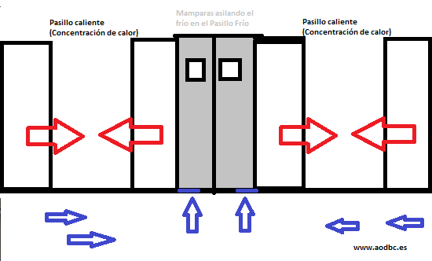

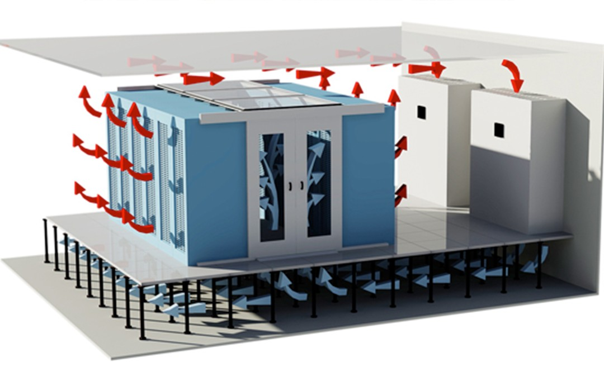

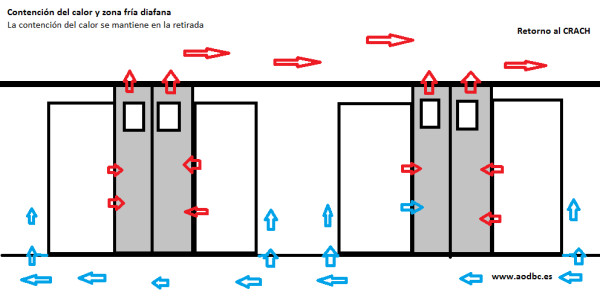

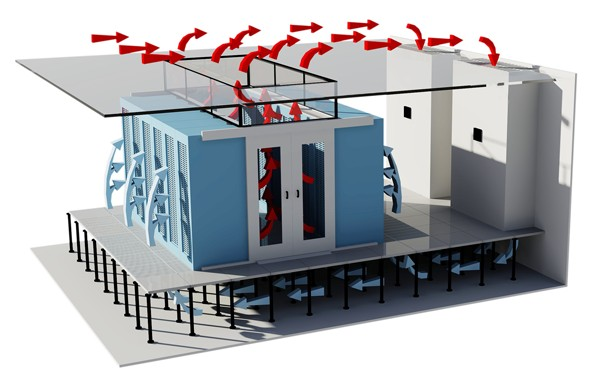

## 4.2.2. Freecooling

Se basa en el empleo del aire exterior más frío para refrigerar los sistemas, sin que tenga que intervenir un aire acondicionado.

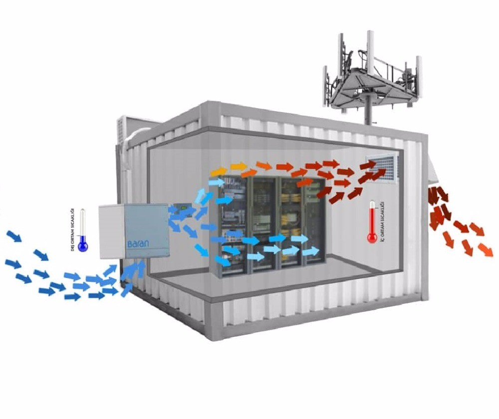

## 4.2.3. Puertas de reducción de carga térmica

Son puertas que facilitan la refrigeración de los armarios.

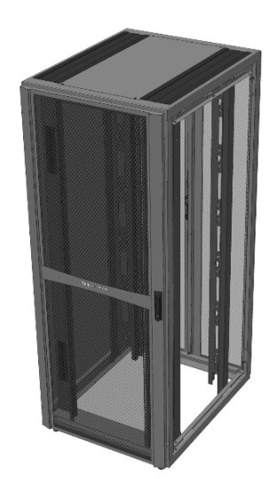
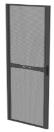
*Rack y puerta térmica.*

## 4.3. Sistemas contra incendios

Medidas pasivas para limitar los daños de un incendio:

- Aspirar y limpiar los equipos. Embalarlos herméticamente.
- Hacer inmediatamente una copia de seguridad de los soportes de almacenamiento.
- Sistemas de extinción.
- Detectores de incendios.
- Extinción automática por CO2.

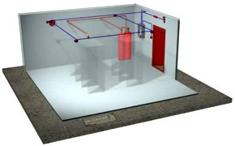

## 4.4. Centros de respaldo

Aún teniendo todas las medidas de seguridad física se puede producir un ataque que deje al CPD inoperativo. Si el servicio es crítico y no se puede interrumpir se necesita un plan B: construir un segundo CPD que pueda encargarse de las tareas del CPD principal si éste deja de funcionar.

¿Qué características debe tener un centro de respaldo?

- Puede tener hardware de distintas características al del CPD principal.
- Debe operar con el mismo software.
- Debe disponer de los mismos datos (redundancia de datos).
- Debe estar lejos (a unos 20-40 km).

## 5. Plan de contingencia física

Es el instrumento que contiene **medidas técnicas, humanas y organizativas** necesarias para garantizar la continuidad de funcionamiento del sistema. Este plan tiene como objetivo **recuperar el sistema ante un ataque en el menor tiempo posible**.

Las fases de la que consta son las siguientes:

1. Identificación de riesgos.
2. Identificación de soluciones.
3. Documentación.
4. Desarrollo de pruebas.
5. Difusión.
6. Mantenimiento.

## 6. Almacenamiento de información

Un aspecto muy a tener en cuenta es el almacenamiento de la información, intentando garantizar la confidencialidad, disponibilidad e integridad de la misma. Para almacenar los datos es necesario clasificarlos según su nivel de confidencialidad y almacenarlos en medios adecuados.

Hay que tener en cuenta que las pérdidas de datos son frecuentes, por lo que es necesario establecer medidas que permitan recuperarlos.

Tampoco hay que olvidarse de realizar un borrado adecuado de la información cuando ya no sea necesaria.

## 6.1. Políticas de almacenamiento

Para todo ello se emplean las **políticas de almacenamiento** que buscan aprovechar el espacio, no perder información y preservar la confidencialidad.

## 6.1.1. Política de almacenamiento en equipos de trabajo

1. Qué tipo de información se puede almacenar en equipos locales.
2. Cuánto tiempo debe permanecer la información en ellos.
3. Dónde se guarda la información dentro de los equipos.
4. Uso de cifrado.
5. Normativa para el almacenamiento de documentos personales (música, fotografías, etc).

## 6.1.2. Política de almacenamiento en la red corporativa

1. Servidores de almacenamiento:
	- Compartir información necesaria para el desarrollo del trabajo.
	- Hay que determinar quién, cómo y cuándo puede acceder a esta información.
2. Carpetas personales y bandejas de correo:
	- Son para uso personal de un empleado (no se comparte).
	- No se debe duplicar contenido almacenado en otros lugares.

## 6.1.3. Política sobre el uso de dispositivos externos

- ¿Están permitidos dispositivos de almacenamiento externo?
- ¿Qué tipo de información se puede almacenar?
- ¿Qué medidas de borrado se deben utilizar?

## 6.1.4. Política de almacenamiento en la nube

- ¿Están permitidas las nubes públicas?
- ¿Qué tipo de información no se puede almacenar en ellas?
- ¿Cómo se borrará la información cuando no sea necesaria?

En los cloud privados hay que cumplir con las políticas de la organización y con las leyes.

## 6.1.5. Política de copias de seguridad

En ella debemos decidir:

- Qué información crítica debe ser recuperable.
- Cada cuánto deben realizarse copias de seguridad.
- En qué soporte se realizan las copias de seguridad.

## 6.2. Almacenamiento redundante y distribuido

El **almacenamiento redundante** consiste en que los datos almacenados en un dispositivo están duplicados en otro u otros.

El **almacenamiento distribuido** consiste en almacenar partes de la información de un fichero en varios dispositivos.

Ambos son necesarios para:

- Aumentar la tolerancia a fallos.
- Aumentar la capacidad de almacenamiento.
- Mejorar el rendimiento en lecturas y escrituras.

## 6.3. Almacenamiento remoto y extraíble

En el **almacenamiento remoto**, como su nombre indica, el dispositivo de almacenamiento no se encuentra en la máquina local. Se accede a él mediante una red.

En el **almacenamiento extraíble** el dispositivo de almacenamiento se puede conectar y desconectar de la máquina sin necesidad de apagar el sistema, es decir, en caliente.

Dentro del almacenamiento remoto podemos distinguir:

## 6.3.1. Network Attached Storage

- Permite compartir la capacidad de almacenamiento de una serie de dispositivos en una red.
- Funciona con una arquitectura cliente servidor.
- La unidad de transmisión es el fichero.
- Los sistemas NAS cuentan con varios dispositivos, normalmente dispuestos en RAID.
- Consumen ancho de banda de la red de datos.
- Tienen su propio sistema operativo (normalmente un Linux ligero) y por lo tanto su propio sistema de ficheros.
- No admiten más periféricos que los discos.
- Son económicos.
- Son una buena solución para redes pequeñas donde se compartan muchos ficheros de pequeño tamaño.

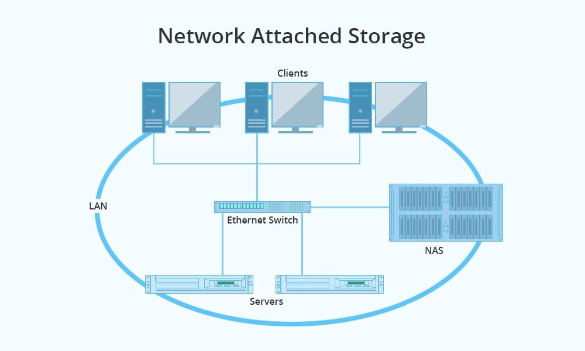

**Synology DiskStation DS120j**: dual core, 512 MB DDR3L, Gigabit Ethernet, 2 bahías para discos 3,5 pulgadas.

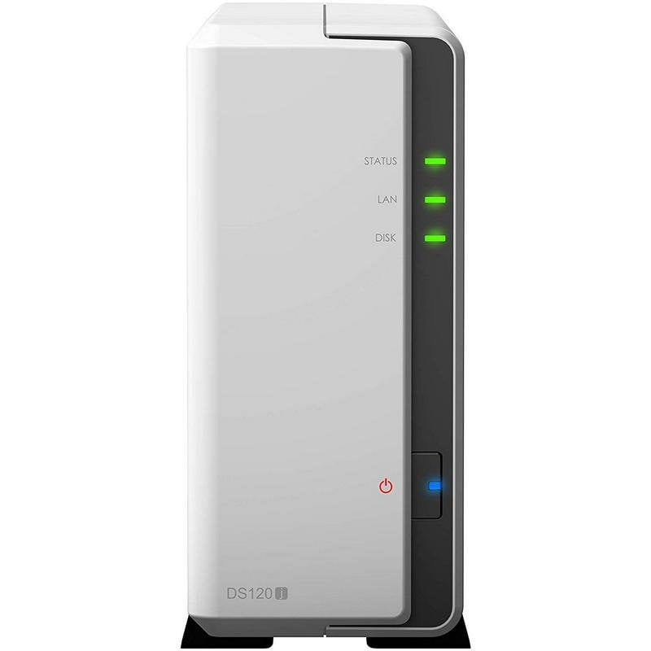

**WD My Cloud EX2 Ultra NAS**: dual core, 1 GB DDR3, Gigabit Ethernet, 1 bahía para discos 3,5 pulgadas.

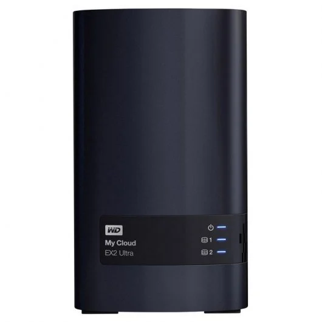

**Qnap TS-431KX-2G NAS**: quad core, 2 GB DDR3, 10 Gigabit Ethernet, 4 bahías para discos 3,5 pulgadas.

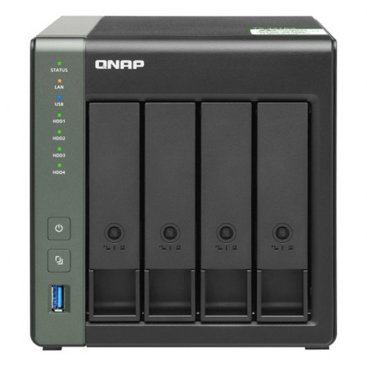

## 6.3.2. Storage Area Network

- Es una red independiente que conecta diferentes dispositivos de almacenamiento con los host.
- Utiliza fibra óptica o iSCSI a nivel de enlace.
- La unidad de transmisión es el bloque.
- El almacenamiento de los datos es centralizado, por lo que se reduce el coste de administración.
- No tiene un punto de fallo único.

SAN es más rápido que NAS y también ofrece mayor disponibilidad.

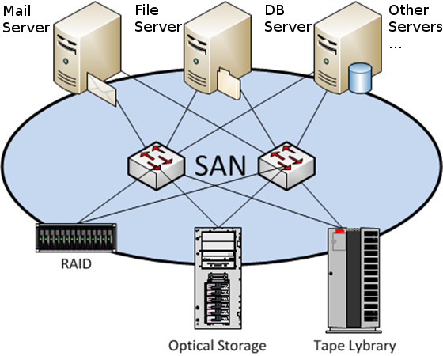

## 6.3.3. Cloud storage

El almacenamiento *en la nube* es un modelo de almacenamiento que hace uso de las redes de ordenadores, almacenando los datos en servidores, normalmente proporcionados por terceros. Es como un NAS externo que además permite sincronizar archivos y carpetas con otros dispositivos (aunque los fabricantes de servidores NAS como QNAP o Synology también incluyen software que proporciona esta sincronización).

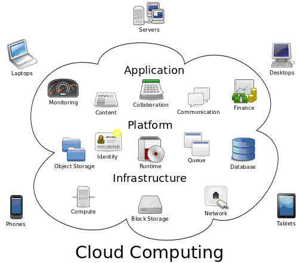

## 7. Hardware de protección física

Este hardware sirve para solucionar problemas relacionados con el sistema eléctrico:

- Bajadas de tensión.
- Picos de tensión.
- Cortes de suministro.

La solución son los **Sistemas de Alimentación Ininterrumpida**, más conocidos como **SAI** o **UPS** por sus siglas en inglés (*Uninterruptible Power Supply*).

## 7.1. Componentes

Los componentes de los que consta un SAI son los siguientes:

- **Rectificador:** convierte la corriente alterna en continua y carga las baterías.
- **Baterías.**
- **Inversor/estabilizador:** convierte de corriente continua a alterna de forma que la corriente de salida tiene una tensión y frecuencia estables.
- **By-pass:** si falla el SAI puentea la corriente de la red eléctrica a la salida. Elimina el punto de fallo único.

## 7.2. Características

## 7.2.1. Potencia

Es la cantidad máxima de energía que puede suministrar un SAI. Se mide en Watios (W) o en Voltamperios (VA):

$$1W = 1VA \times fp$$

**fp:** Factor de potencia. De forma estandarizada es un 60 %.

Es recomendable que la potencia de los equipos conectados a un SAI no exceda el 80 % de su potencia.

¿Cómo sabemos qué SAI comprar en cuanto a potencia? Para ello calcularemos la potencia de los dispositivos que vamos a conectar al mismo. Nos valdremos de especificaciones técnicas, medidor de potencia o amperímetro.

Una vez obtenida la potencia de cada uno de los dispositivos que vayamos a conectar, las sumamos y obtendremos el valor buscado.

**Ejemplo:**

Tenemos un SAI de 600 VA al que conectaremos un ordenador que consume 150 W, un monitor que consume 70 W y una impresora de 250 W.

1. ¿Podemos alimentar los 3 dispositivos con el SAI?

$$150W + 70W + 250W = 470W$$

$$600VA \times 0,6 = 360W < 470W$$

$$\frac{470W}{0,6} = 783,33VA > 600VA$$

Por tanto, el SAI que tenemos no nos sirve para alimentar los 3 dispositivos a la vez.

2. ¿Qué combinaciones de dispositivos podemos conectar?
	a) La impresora y el monitor.
	b) El ordenador y el monitor.

3. ¿Cuál sería la más adecuada? La más adecuada sería conectar el ordenador y el monitor.

## 7.2.2. Autonomía

Es el tiempo que puede proporcionar corriente sin suministro de la red eléctrica.

Obviamente es un factor relativo al uso pues depende de la carga útil. Muchos fabricantes no lo facilitan, pero podemos calcularlo en función de las características técnicas de la batería:

- **N**úmero de las baterías (N)
- **V**oltaje de las baterías (V)
- **A**mperios-hora (Ah)
- **E**ficiencia del SAI (Ef) (94 %-98 %)
- **V**oltamperios (VA)

$$\frac{N \times V \times Ah \times Ef}{P (W)} = \text{AUTONOMÍA (h)}$$

**Ejemplo:**

Tenemos un SAI con una capacidad de 2000 VA y una batería que proporciona 24 V de corriente continua a partir de 2 módulos de 12 V y 9 Ah. Su eficiencia es del 96 %.

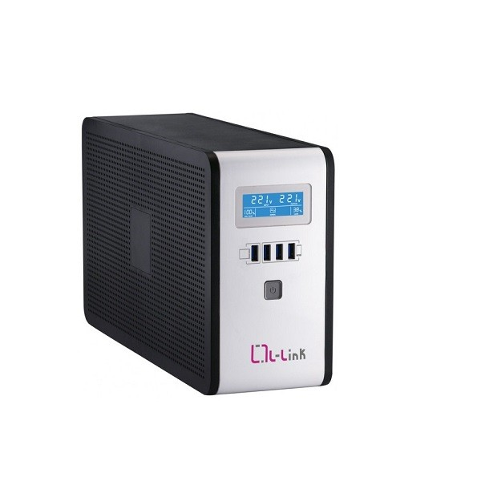

1. ¿Cuánto tiempo puede suministrar energía el SAI con el máximo de carga útil (si los equipos conectados consumen toda su capacidad)?

Tomando como FP el 60%:

$$\frac{2 \times 12 \times 9 \times 0,96}{2000 * 0.6} = 0,1728h$$

Lo multiplicamos por 60 para calcularlo en minutos: $$0,1728 * 60 = 10,36 min$$

2. ¿Y si los dispositivos conectados consumen 250 W?

$$\frac{2 \times 12 \times 9 \times 0,96}{250 W} = 0,82944h = 49,81min$$

## 7.2.3. Tiempo de recarga

Es el tiempo que tarda el SAI en cargar sus baterías después de una descarga. Los fabricantes suelen darlo en función del porcentaje de carga (p.ej. 5 horas al 90 %).

Es importante conocerlo pues puede que necesitemos implementar medidas de seguridad extra durante el tiempo de recarga.

## 7.2.4. Tipos de conectores

Son las conexiones eléctricas que proporciona el SAI. Podemos tener las siguientes:

- **SCHUKO:**

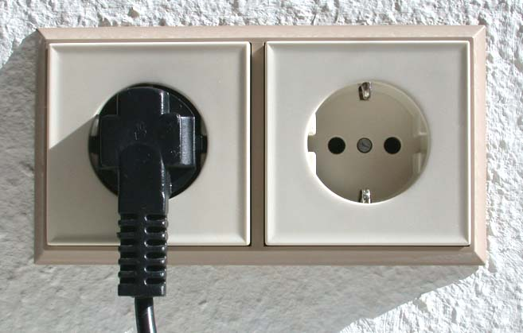

- **IEC:** tenemos los C13 y C14.

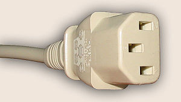
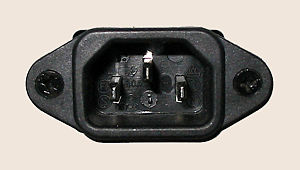
*Conectores IEC.*

## 7.2.5. Arranque en frío

Es la capacidad de poder encender el SAI sin suministro eléctrico. No todos los SAI pueden realizar esta operación.

## 7.3. Tipos de SAI

## 7.3.1. SAI Offline

Son los más sencillos. En estos SAI, mientras haya corriente en la entrada ésta es suministrada directamente a los dispositivos a la vez que también se cargan las baterías.

Cuando se produce un corte en la corriente de entrada, un conmutador transfiere la corriente de las baterías al inversor.

Ante un corte de suministro los dispositivos se quedan sin energía nanosegundos.

En modo de funcionamiento normal, no filtra la corriente alterna.

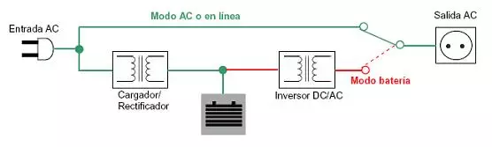

## 7.3.2. SAI Interactivo (Inline)

Estos SAI ya son más avanzados. Mientras haya corriente en la entrada ésta se filtra con un regulador de tensión (AVR) y se proporciona a la salida.

Cuando se produce un corte en la corriente de entrada, un conmutador transfiere la corriente de las baterías al inversor.

Ante un corte de suministro los dispositivos se quedan sin energía nanosegundos.

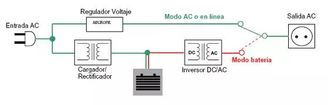

## 7.3.3. SAI Online

Son los más avanzados. En ellos, sea cual sea la tensión de entrada siempre se proporciona una tensión a la salida.

Las baterías están trabajando todo el rato, lo que reduce su vida útil.

Nunca se producen cortes de suministro (ni en cortos periodos de tiempo).

Se recomienda utilizarlos en equipos de altas prestaciones y delicados.

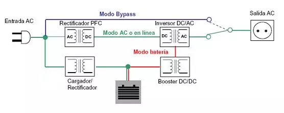

## 7.4. Arquitectura entre SAI

## 7.4.1. Distribuida

Cada carga se conecta a su propio SAI, por lo que habrá tantos como cargas, lo que implica:

- Mantenimiento y gestión compleja.
- Hay que gestionar el apagado de emergencia en cada máquina por separado.
- Dificultad para realizar redundancia de SAI.

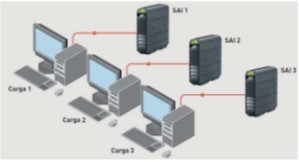

## 7.4.2. Centralizada

En este tipo de arquitectura un único SAI controla varias cargas simultáneamente, lo que implica:

- Ahorro de costes en gestión y mantenimiento.
- Es más sencillo proteger el propio SAI.
- Al ser único, supone un único punto de fallo.
- Tiene unos costes de expansión elevados.

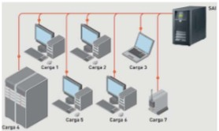

## 7.4.3. Modular

Para mejorar los puntos débiles de la arquitectura centralizada tenemos este tipo de arquitectura compuesta de varios SAI independientes (módulos) que funcionan de forma conjunta, permitiendo añadir o quitar módulos en función de las necesidades. Esto facilita la expansión de la instalación y mejora el mantenimiento respecto a la centralizada.

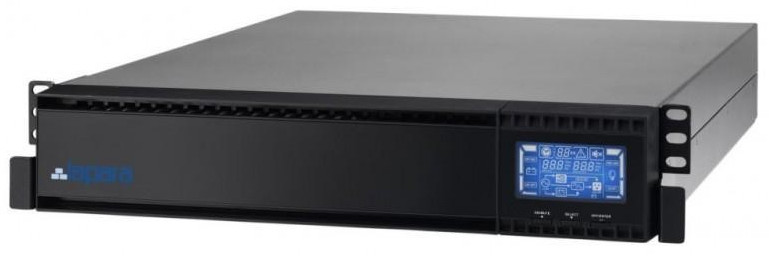

## 7.4.4. Modular granulada

En este caso los módulos deben de ser de pequeña potencia de modo que si falla uno el comportamiento general de la arquitectura no se ve afectado.

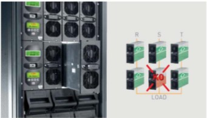
